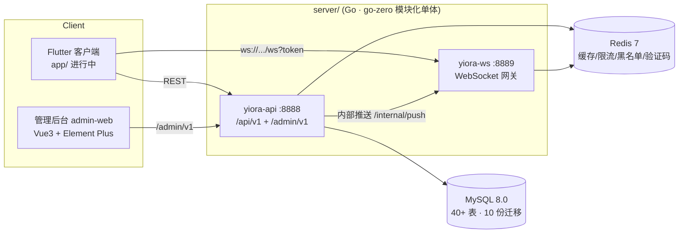

# Yiora 社区 · 交付总纲

> 版本:v1.0(2026-07)  范围:后端 API + WS 网关 + 管理后台前后端 + 交付基线
> 需求依据:`docs/Yiora开发需求文档.md`(M2 社区内核 / M3 软件库与忧珠 / M4 商城付费 / P0-P2 细节 / 3.12 管理后台)

## 一、总体架构



- **分层**:handler(路由/鉴权)→ logic(业务)→ model(SQL/事务),DTO 统一在 `internal/types`。
- **鉴权**:用户 JWT(7 天,注销/封禁经 Redis 黑名单即时吊销);管理 JWT(8 小时,claim 隔离,RBAC 权限码)。
- **一致性**:资金路径(忧珠)全事务 + 幂等 biz_key + 死锁重试;计数增减随状态流转同事务回补。

## 二、模块清单

| 模块 | 位置 | 要点 |
| --- | --- | --- |
| 账号 | authlogic / userlogic | 邮箱注册登录、找回、注销(token 吊销)、资料、关注/拉黑、足迹/收藏 |
| 社区 | postlogic / commentlogic / circlelogic | 发帖(话题/共创/付费段)、编辑重审、评论(帖/软件多业务对象)、圈子(圈主置顶/加精/禁言/删帖) |
| 私信 | imlogic + ws | 会话/消息/撤回(2 分钟,DB 时钟)、拉黑、AI 管家(FAQ 规则应答+新人欢迎) |
| 软件库 | softwarelogic | 发布(人审)、版本、分类/标签、下载计数 |
| 忧珠经济 | tasklogic / youzhulogic / malllogic | 任务/签到、账本(幂等)、装扮/靓号/抽奖、付费解锁帖(作者分成)、每日对账 |
| 搜索 | searchmodel | MySQL LIKE 落地,Searcher 接口预留 Meilisearch |
| 内容安全 | sensitive + audit_queue | 三级词库(拦截/人审/打码,后台热更新)、人审工作台 |
| 管理后台 | adminlogic + admin-web | 见下节 |

## 三、管理后台(14 页 · /admin/v1 40 接口)

登录安全:图形验证码(SVG 自绘,Redis 一次性)→ 同账号 5 次错密锁 15 分钟 → IP 白名单(`Admin.IPAllowlist`)→ 首登强制改密(前端守卫+后端硬拦截)。

| 页面 | 能力 |
| --- | --- |
| 数据看板 | 八项指标卡片 + ECharts 近 7/30/90 日注册·发帖·忧珠四曲线(按日补零) |
| 审核工作台 | 帖/评/软件机审队列,过审计数补记,驳回必填原因,CAS 防重,通知作者 |
| 内容管理 | 帖/评关键词+全状态检索,一键下架/恢复(圈子/话题/评论计数自动回补) |
| 举报处理 | 待处理 FIFO+目标摘要回查,弹窗内快捷下架/禁言封禁,结单通知举报人 |
| 认证审核 | 达人/开发者认证裁决+徽章 |
| 用户管理 | 昵称/编号/邮箱搜索+状态筛选,禁言/封禁/恢复(Redis 即时生效,存量 token 受控) |
| Banner / 公告 | 定时投放;公告单 SQL 全员扇出系统通知 |
| 敏感词库 | CRUD+等级调整,`Filter.Invalidate()` 热更新,无需重启 |
| AI 管家 FAQ | 词条 CRUD,botReply 实时查库即时生效 |
| 商城/任务配置 | 装扮·奖池·任务三 tab CRUD(status 上下架,不物理删) |
| 软件分类 | 应用/游戏两榜,停用即从发布表单隐藏 |
| 账号管理 | 建号/角色分配/停用/重置密码,禁止自操作;角色:超管/审核员/运营 |
| 操作日志 | 全部敏感操作留痕 admin_op_log |

## 四、部署与运维手册

### 本地/联调(docker compose)

```powershell
cd server
docker compose up -d --build      # MySQL(13306)/Redis(6379)/API(8888)/WS(8889),迁移自动执行
cd ..\admin-web
npm install; npm run dev          # http://localhost:5173,初始 admin/admin123(首登强制改密)
```

### 生产(docker-compose.prod.yml)

1. `cp .env.prod.example .env.prod` 填齐:JWT 密钥、MySQL/Redis 密码、SMTP、`YIORA_ADMIN_IP_ALLOWLIST`(逗号分隔 IP/CIDR,留空不限)。
2. `docker compose -f docker-compose.prod.yml --env-file .env.prod up -d`,镜像来自 GHCR(CI 自动发布),Caddy 终结 TLS 并反代 api/ws,内网隔离 `/internal/push`。
3. `admin-web`:`npm run build` 产物 `dist/` 托管到任意静态服务,反代 `/admin/v1` 到 api。

### 发版前回归基线

```powershell
cd server; powershell -File .\scripts\smoke.ps1
# down -v 重置 → 起栈 → 依次跑 community/software/m3/mall/paid-ai/content/account/p1/p2/admin 十套件
# 期望输出 SMOKE RESULT: ALL PASSED
```

CI(GitHub Actions):build + vet + 单测(-race) + testcontainers 并发集成测试(忧珠/解锁/抽奖) + Docker 镜像发布。

### 常用 runbook

| 场景 | 操作 |
| --- | --- |
| 管理员被错密锁定 | `docker exec yiora-redis-1 redis-cli DEL admin:login:fail:<username>` |
| 管理员忘记密码 | 超管在「账号管理」重置(对方首登强制改密);超管自己忘 → UPDATE admin_user 写入新 bcrypt 并置 must_change_pwd=1 |
| 敏感词误拦 | 后台「敏感词库」改等级/删除,保存即热更新 |
| 忧珠账不平 | api 每日对账 goroutine 打 ERROR 日志;按 youzhu_log(幂等 biz_key)与 youzhu_account 差额定位 |
| 新增迁移 | sql/ 按序号追加,dev 重置卷自动执行;生产对已有库手动执行增量文件 |

## 五、质量基线

- 冒烟:十套件 ≈ 90 组断言,覆盖注册→发帖→评论→私信→举报→审核→处置→运营配置全链路(含验证码/锁定/热更新等安全路径)。
- 单测:敏感词过滤、幂等点赞、IM seq、JWT、任务结算、IP 白名单等 12+;集成:真实 MySQL 并发(50 并发记账/解锁/抽奖,死锁重试验证)。
- admin-web:vue-tsc 严格模式零错误。

## 六、已知限制与二期路线

| 项 | 现状 | 二期建议 |
| --- | --- | --- |
| 搜索 | MySQL LIKE,中文分词弱 | 切 Meilisearch(Searcher 接口已预留) |
| 公告扇出 | 单 SQL 全员插入 | 十万级用户改 MQ 分批(代码处已标注) |
| 敏感词匹配 | 朴素子串 O(词数×文本长) | 词库过万换 Aho-Corasick |
| 对象存储 | 图片/APK 仅存 URL,无上传服务 | 接 OSS/S3 预签名直传 |
| AI 管家 | 关键词规则 | 接大模型(botReply 单点替换) |
| 通知推送 | 站内信+WS 在线推 | 接 APNs/厂商通道离线推送 |
| 管理后台 | 无二步验证/看板导出 | TOTP、报表导出、告警订阅 |
| Flutter 客户端 | 骨架进行中(app/) | 按需求文档 M2-M4 页面逐屏落地 |
